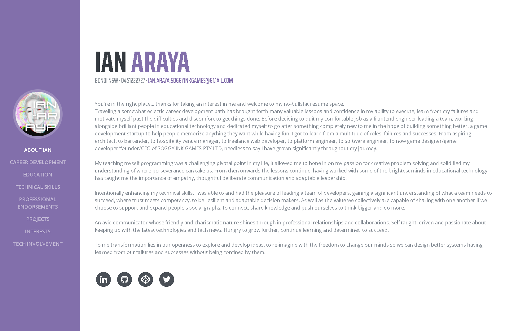

# A Web Resume
A web version of my resume, when you wanna save the trees and show off your mad skills. Sometimes a lil MVC is all you need.
Scrollable page with web links to fun sites like github, linkedin, codepen, twitter.
ps. this is not my personal info, but have a play around with yours. Well some of it might be my info


### VIEW THIS RESUME
Check out the [DEMO APP](https://anaizing.github.io/web-resume/) hosted on Github Pages

### EDIT YOUR OWN TO YOUR LINKING
Its pretty much one long html file you can edit around to your liking on the root. <br>
Im using `browser-sync` to view live demo of site pre-launching.
You'll need to install [Browser Sync](https://browsersync.io/) globally

```
npm install -g browser-sync
```
then to view the file at
```
browser-sync start --server --files "css/*.css"
```
### CREATE YOUR OWN FAVICON
I added my own initial as a favicon to the browser tab with a favicon generator

follow instructions [here](https://favicon.io/favicon-generator/) and replace with paths to your png files in the header of the html.
